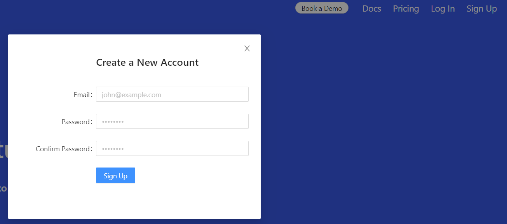
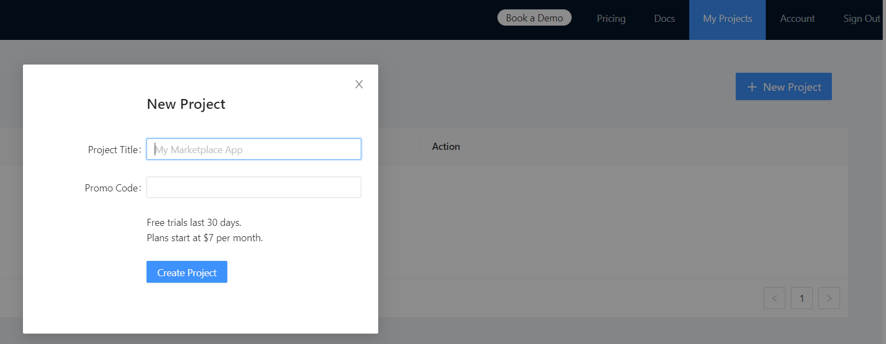
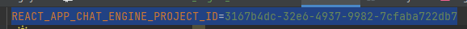
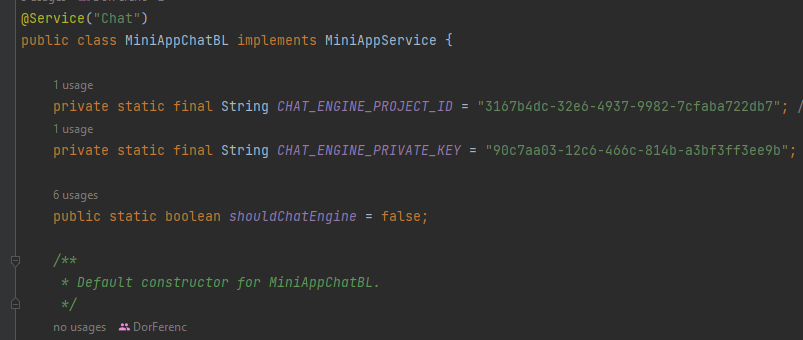

# Using Chat Engine

* [Chate Engine](https://chatengine.io/) is an externally free up to 7 days and 10 users chat API.

## Getting Started

### Open a Chat Engine Account

* Go to the [Chate Engine](https://chatengine.io/) website.
* Click `Sing Up`, enter you credentials and Create a New Account.




### Creating a New Project

* Login to your new account.
* Go to `My Projects` and `+ New Project`.
* Give your project a: `Project Title`.
* No need to fill in the Promo Code.
* Create Project.



### API Keys

* In your project go to: `Project Settings`
* You will see both your API Keys: 
```agsl
Project ID
Private Key
```

## Adding Keys to ApartMate project

* In order to use our project you need to add the keys in 2 places.
* Chat client code && ApartMate backend code.

### Adding Keys to Chat Client Code

* Go to Chat [.env](.env) file.
* Change the UUID existing in `REACT_APP_CHAT_ENGINE_PROJECT_ID` to your `Project ID` API Key from chat engine.



### ApartMate backend code

* Go to ApartMate `MiniAppChatBL`
* Change the `CHAT_ENGINE_PROJECT_ID` to your `Project ID` API Key from chat engine.
* and `CHAT_ENGINE_PRIVATE_KEY` to your `Private Key` API Key from chat engine.

